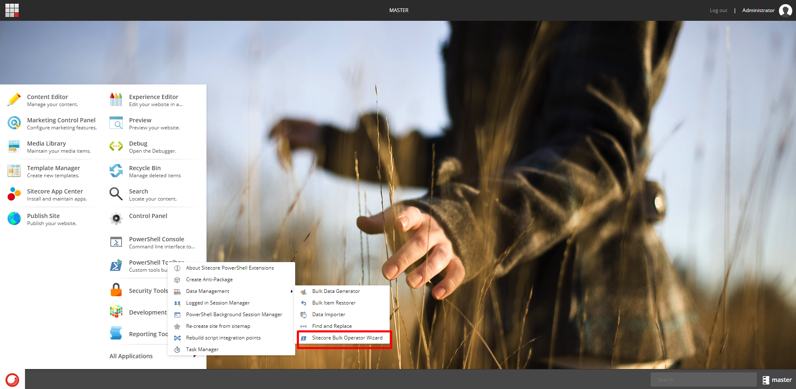
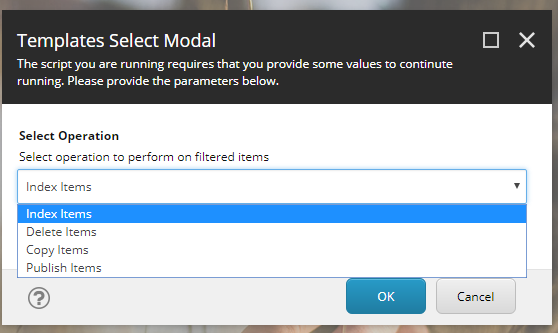
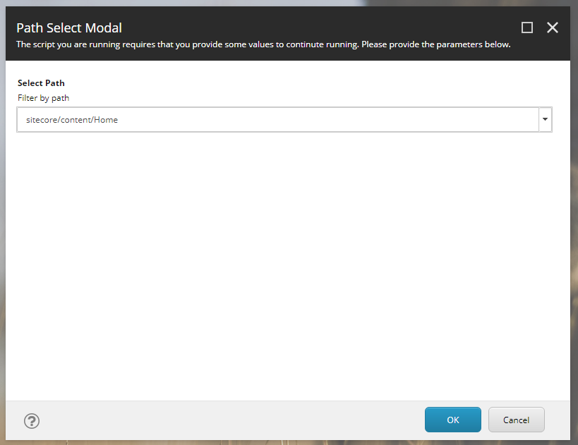
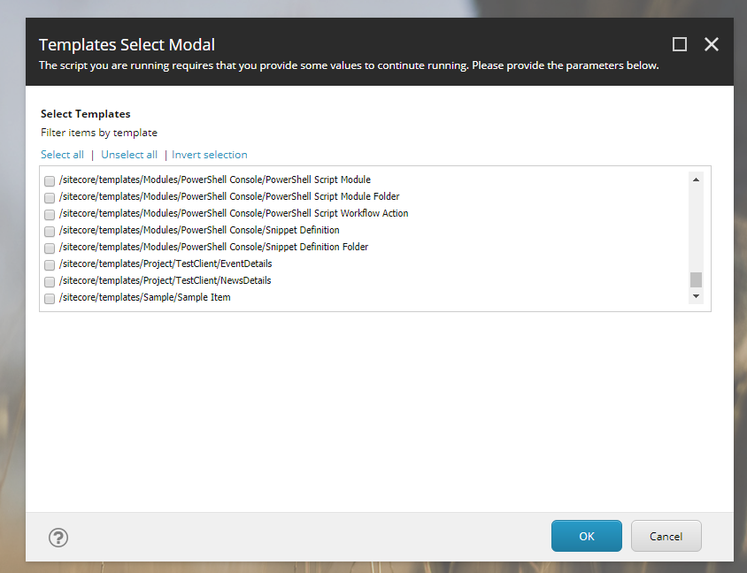
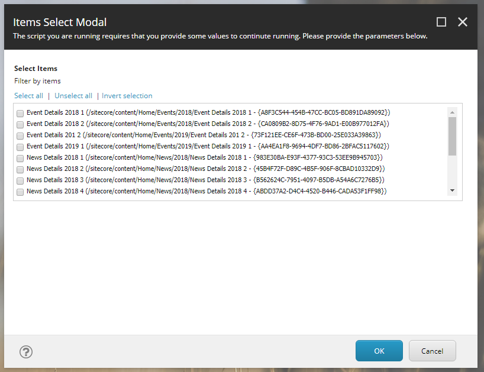
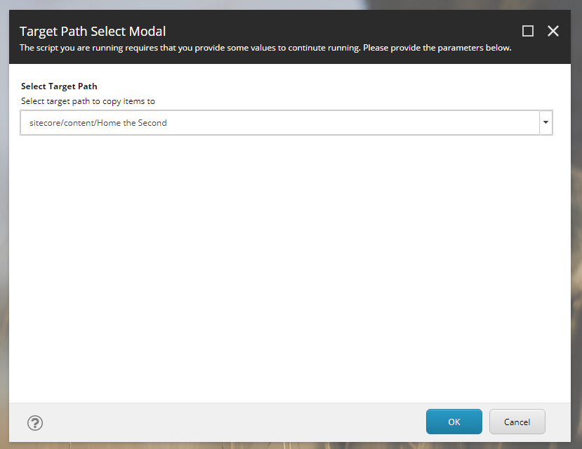
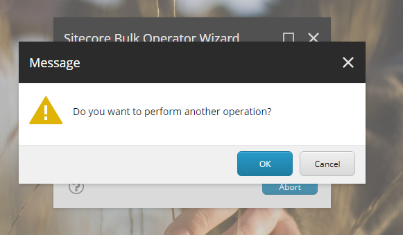

# Sitecore Hackathon 2019 Entry Documentation

## Category: `Best use of SPE to help Content authors and Marketers`

## Entry Title: `Sitecore Bulk Operator`

### <b>Brief Description/Purpose</b>: Sitecore Powershell Extension (SPE) scripts that allow Content Authors and Marketers to perform bulk operaitons on a selection of data items. This module allows future addition of more operations to be performed on the selection of data by installing a package that contains the new operation scripts only.

Video description: https://youtu.be/FvNdTv4urx4

### <b>Prequisites</b>
Sitecore Powershell Extensions v5

### <b>Installation</b>
To install this module, all you have to do is install the Sitecore package provided which will install several new SPE scripts under `/sitecore/system/Modules/PowerShell/Script Library/Custom/Library`

### <b>Features</b>
Once installed this module, at the moment, will provide the following features:
    
- Selectors:
    * `Select Path` to search in
    * `Select Templates` to filter
    * `Select Items` to perform operations on (checklist)
- Operators (more can be easily added):
    * `Index Items`
    * `Copy Items`
    * `Delete Items`
    * `Publish Items`

To start using any of the above operators:
- In Sitecore Desktop, click on the start button
- Click on `Powershell Toolbox` > `Data Management` > `Sitecore Bulk Operator Wizard`
- You will start getting a series of prompts that you will need to fill to provide the needed data to perform the required operation

Once an operation is complete you will be prompted to start the wizard again to perform another operation or the same one on a different selection of data

#### Example for running a Copy Items Operation








### <b>Adding a new operator</b>
In order to add a new operator at any time after installing this module:
- Navigate to `/sitecore/system/Modules/PowerShell/Script Library/Custom/Library/Bulk Operator/Operations`
- Add a new `PowerShell Script` item or copy and existing one
- Edit the script according to your requirements, however the only required part is the input param at the top of the script:
```
param($params);
$itemsString = $($params.items);
$items = $itemsString.split('|')
```
- You will have to use the `$items` variable that contains a list of selected item IDs

